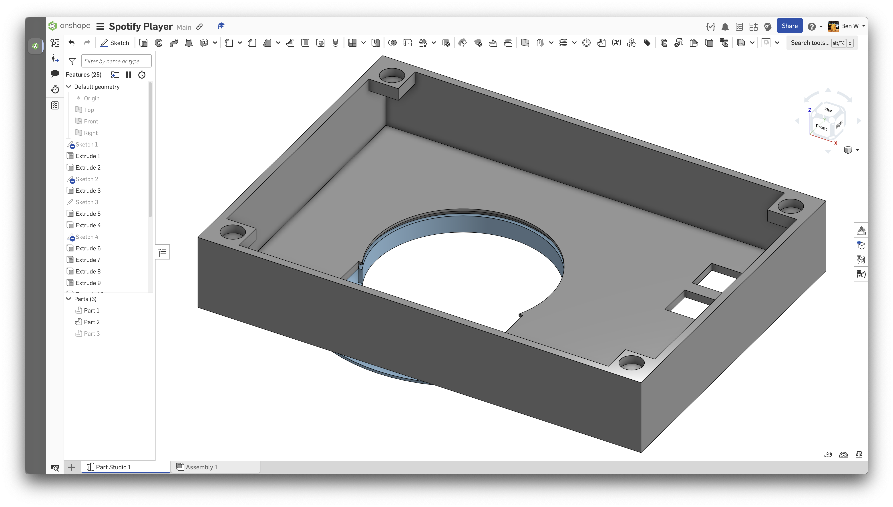
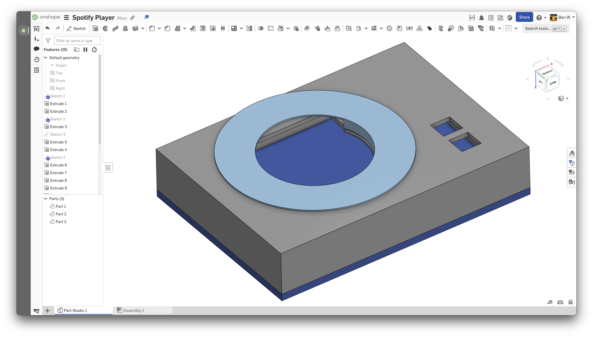
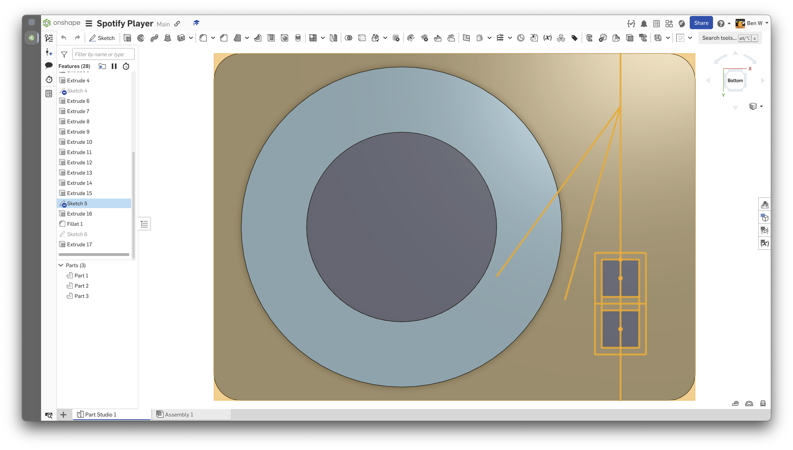
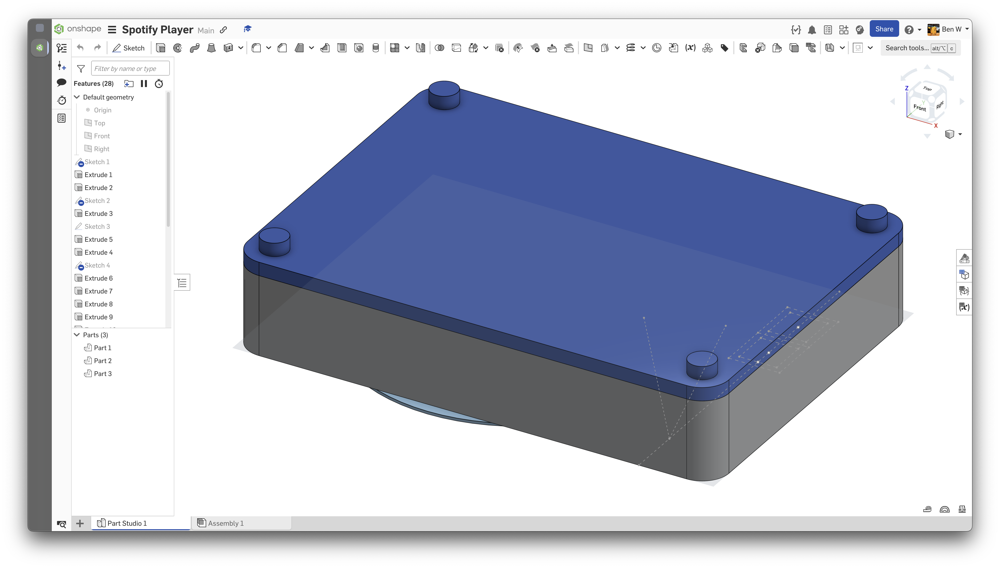
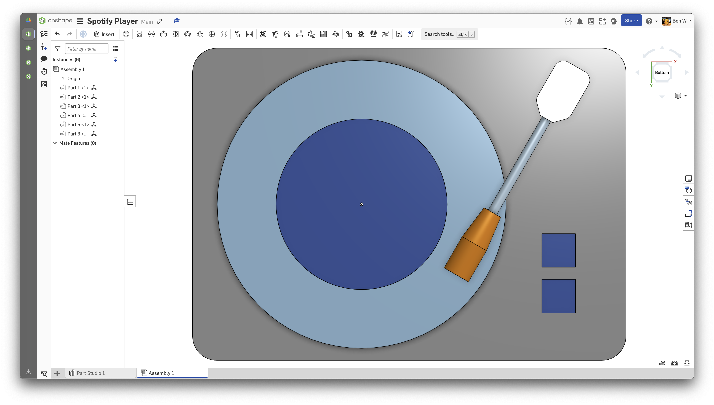
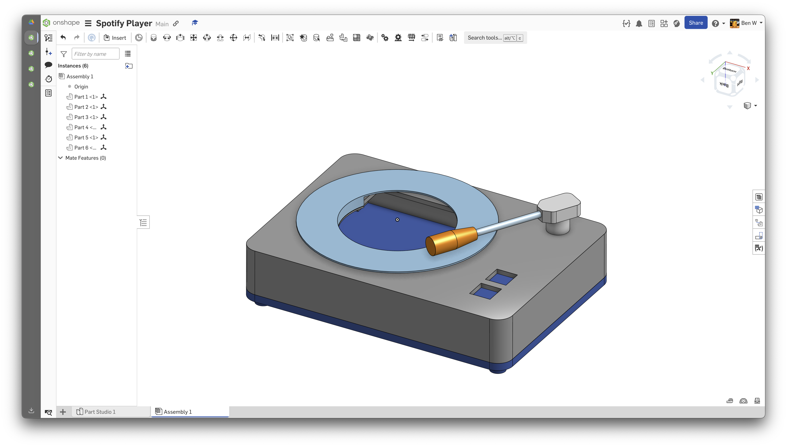
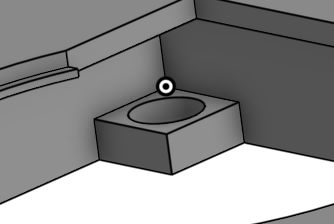

Total time (so far): 17.5 hrs

# Journal of Changes
## 2025-05-30
Spent ages fighting with spotifyd, spotify-cli-linux, spotify-tui, raspotify, librespot, and other spotify clients. None of them worked.
Eventually I made an [issue](https://github.com/Spotifyd/spotifyd/issues/1221#issuecomment-2925151914) and found out it probably will not work.
Time spent: 6 hrs

## 2025-06-01
So there's this cool library called spotipy which I probably should have used in the first place. It has a python client that can control spotify so I can interface it with GPIO pins too :)
Also spent a while trying to get it to work with my HDMI display and the X server

(i think i've had my yearly dose of solder fumes from soldering the GPIO pins :|)

Time spent: 5 hrs

## 2025-06-01
Made a basic case - yet to do the needle assembly and the legs, but everything else should be done (note: the big hole in the disc is for the screen to fit through)

Time spent: 3 hrs

## 2025-06-05
Feet, fillets, and fiddling with needle angles (after research I decided to use a rotary encoder instead of a 36-detent rotary encoder :| bc they are really expensive)

Time Spent: 30 mins

## 2025-06-08
Modelled the needle assembly, also moved the magnets in the case to be inserted from above so the magnets in the case and bottom are not touching.
I think I've finished the case :)

Time spent: 2 hrs

## 2025-06-13
Exams are over :)

I have realised that I do NOT need an Extremely Overpowered pi zero for this, so I am moving to a 2.8 inch display with an ESP32 baked right in.

Also figured out the wiring.

Time spent: 1 hr
