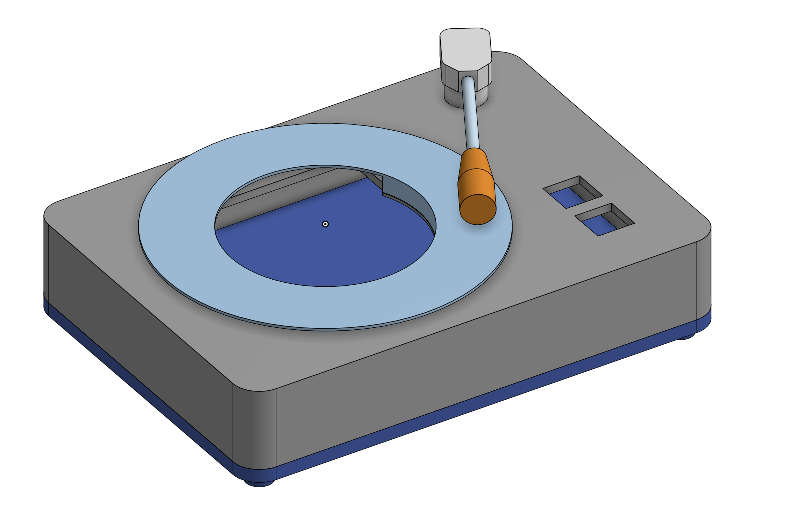
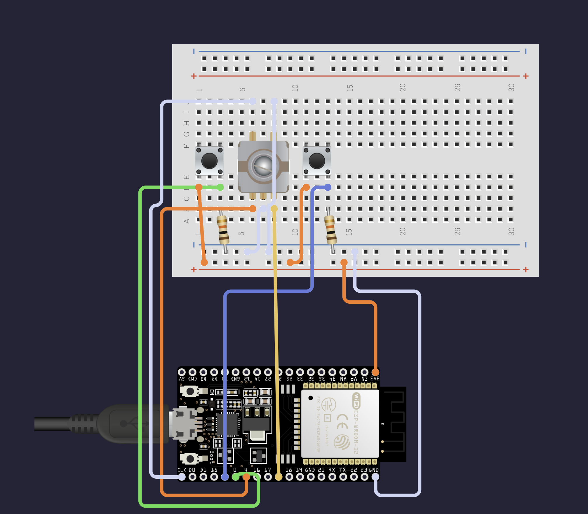

# Spotify Turntable
A spotify controller that looks like a cute turntable! Uses an ESP32 to connect to the Spotify API and control playback, and displays the current track on a small HDMI display. The turntable is made from a 3D-printed case.


## Features
- Control Spotify playback (play, pause, next, previous)
- Display current track information on a small display
- Looks like a cute turntable with a 3D-printed case and a vinyl with your song's album art

## BOM
- 2.8 inch circular HDMI display with ESP32 without touch (e.g. [this](https://www.aliexpress.com/item/1005008550178220.html?src=google&pdp_npi=4@dis!AUD!54.99!54.99!!!!!@!12000045664378399!ppc!!!&gPromoCode=5000000171197014))
- 3D-printed case (files in `case/`)
- 15mm half shaft rotary encoder e.g. [this](https://www.aliexpress.com/item/1005004907970664.html?spm=a2g0o.productlist.main.5.2da045d1nlJrMq&aem_p4p_detail=202506020223422245208670988800003310716&algo_pvid=1ed82abb-ead1-40ac-a9ce-d23354ae28b5&algo_exp_id=1ed82abb-ead1-40ac-a9ce-d23354ae28b5-4&pdp_ext_f=%7B%22order%22%3A%22919%22%2C%22eval%22%3A%221%22%7D&pdp_npi=4%40dis%21AUD%212.61%211.82%21%21%2112.00%218.37%21%40210318ec17488562220337880ee573%2112000035534364750%21sea%21AU%210%21ABX&curPageLogUid=be3vKUHMXXIE&utparam-url=scene%3Asearch%7Cquery_from%3A&search_p4p_id=202506020223422245208670988800003310716_5)
- 8x 8mm diameter, 3mm thick neodymium magnets e.g. [this](https://www.bunnings.com.au/everhang-8mm-rare-earth-disc-magnet-10-pack_p3690098)
- 2x Cherry MX switches
- 2x Cherry MX keycaps
- 2x 10kΩ resistors
- Jumper wires

## Wiring
Something like this:


## Setting Up
(will refine this when I get the parts)
1. Get your Spotify API credentials by creating an app on the [Spotify Developer Dashboard](https://developer.spotify.com/dashboard/applications). You will need the Client ID and Client Secret.
2. Clone this repository:
    ```bash
    git clone https://github.com/wenbang24/spotify-turntable
    cd spotify-turntable
    ```
3. Create a `.env` file in the root of the repository with your Spotify API credentials:
    ```plaintext
    SPOTIFY_CLIENT_ID='your-spotify-client-id'
    SPOTIFY_CLIENT_SECRET='your-spotify-client-secret'
    SPOTIFY_REDIRECT_URI='your-app-redirect-url'
    ```

    Note: The redirect URI can be set to `http://localhost:8888/callback` - it doesn't really matter.
4. Run the `spotify_turntable.py` script to start the application and cache authentication details:
    ```bash
    python3 spotify_turntable.py
    ```

    Follow the instructions.
